# Trabajo Práctico N° 1: Informe

- Universidad Nacional de Cuyo
- Facultad de Ingeniería
- Licenciatura en Ciencias de La Computación
- Arquitecturas Distribuidas 2024
- Tema: Paralelismo a Nivel de Datos

## Introducción

En este trabajo práctico se pide resolver problemas paralelizables empleando la
técnica de multihilos para disminuir el tiempo de ejecución o incrementar el
throughput.

En todos los ejercicios se pide obtener datos sobre tiempos de ejecución para
calcular speedups y visualizar porcentajes de uso de cada núcleo de su
computador.

## Objetivos

- Resolver diferentes problemas con cierto grado de paralelismo mediante la
técnica de multihilos empleando librerías y C++.
- Analizar las ventajas y limitaciones de esta técnica.

## Entornos

- [Github Codespaces](https://github.com/features/codespaces)

```plaintext
$ lscpu
Architecture:                       x86_64
CPU op-mode(s):                     32-bit, 64-bit
Byte Order:                         Little Endian
Address sizes:                      48 bits physical, 48 bits virtual
CPU(s):                             2
On-line CPU(s) list:                0,1
Thread(s) per core:                 2
Core(s) per socket:                 1
Socket(s):                          1
NUMA node(s):                       1
Vendor ID:                          AuthenticAMD
CPU family:                         25
Model:                              1
Model name:                         AMD EPYC 7763 64-Core Processor
Stepping:                           1
CPU MHz:                            2603.123
BogoMIPS:                           4890.86
Virtualization:                     AMD-V
Hypervisor vendor:                  Microsoft
Virtualization type:                full
L1d cache:                          32 KiB
L1i cache:                          32 KiB
L2 cache:                           512 KiB
L3 cache:                           32 MiB
NUMA node0 CPU(s):                  0,1
```

- Computadora

```plaintext
$ lscpu
Architecture:             x86_64
  CPU op-mode(s):         32-bit, 64-bit
  Address sizes:          43 bits physical, 48 bits virtual
  Byte Order:             Little Endian
CPU(s):                   4
  On-line CPU(s) list:    0-3
Vendor ID:                AuthenticAMD
  Model name:             AMD Ryzen 3 3250U with Radeon Graphics
    CPU family:           23
    Model:                24
    Thread(s) per core:   2
    Core(s) per socket:   2
    Socket(s):            1
    Stepping:             1
    Frequency boost:      enabled
    CPU(s) scaling MHz:   66%
    CPU max MHz:          2600.0000
    CPU min MHz:          1400.0000
    BogoMIPS:             5189.88
    Flags:                fpu vme de pse tsc msr pae mce cx8 apic sep mtrr pge mca cmov pat pse36 clflush mmx fxs
                          r sse sse2 ht syscall nx mmxext fxsr_opt pdpe1gb rdtscp lm constant_tsc rep_good nopl n
                          onstop_tsc cpuid extd_apicid aperfmperf rapl pni pclmulqdq monitor ssse3 fma cx16 sse4_
                          1 sse4_2 movbe popcnt aes xsave avx f16c rdrand lahf_lm cmp_legacy svm extapic cr8_lega
                          cy abm sse4a misalignsse 3dnowprefetch osvw skinit wdt tce topoext perfctr_core perfctr
                          _nb bpext perfctr_llc mwaitx cpb hw_pstate ssbd ibpb vmmcall fsgsbase bmi1 avx2 smep bm
                          i2 rdseed adx smap clflushopt sha_ni xsaveopt xsavec xgetbv1 clzero irperf xsaveerptr a
                          rat npt lbrv svm_lock nrip_save tsc_scale vmcb_clean flushbyasid decodeassists pausefil
                          ter pfthreshold avic v_vmsave_vmload vgif overflow_recov succor smca sev sev_es
Virtualization features:
  Virtualization:         AMD-V
Caches (sum of all):
  L1d:                    64 KiB (2 instances)
  L1i:                    128 KiB (2 instances)
  L2:                     1 MiB (2 instances)
  L3:                     4 MiB (1 instance)
NUMA:
  NUMA node(s):           1
  NUMA node0 CPU(s):      0-3
```

## Ejercicio 1

### Codespaces


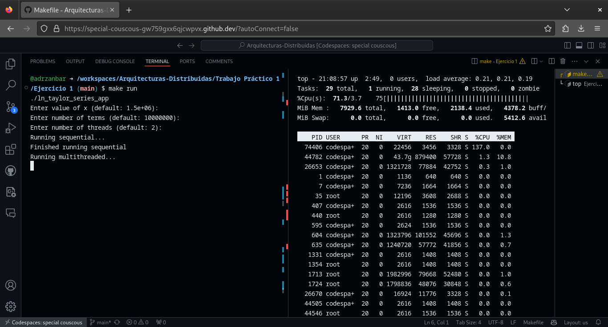

#### Output

```plaintext
Enter value of x (default: 1.5e+06): 
Enter number of terms (default: 10000000): 
Enter number of threads (default: 2): 
Running sequential...
Finished running sequential
Running multithreaded...
Finished running multithreaded
Sequential Time: 4.65159 seconds
Multithreaded Time: 2.81867 seconds
Number of Threads Used: 2
Number of Threads Available on System: 2
Speedup: 1.65028
Efficiency: 0.825141
Sequential result: 14.220975666072336
Multithreaded result: 14.220975666072350
```

### Computadora

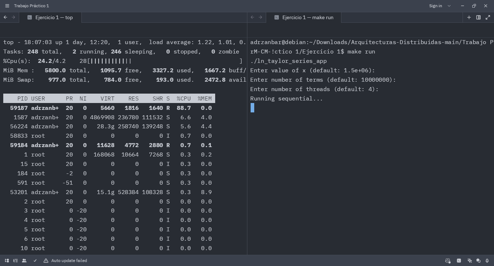

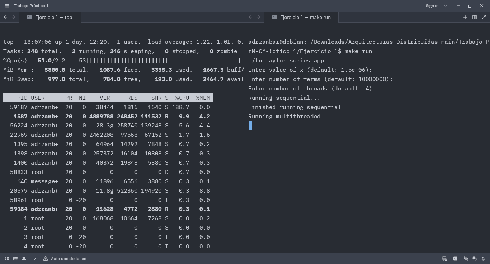

#### Output

```plaintext
Enter value of x (default: 1.5e+06):
Enter number of terms (default: 10000000):
Enter number of threads (default: 4):
Running sequential...
Finished running sequential
Running multithreaded...
Finished running multithreaded
Sequential Time: 7.07629 seconds
Multithreaded Time: 3.20959 seconds
Number of Threads Used: 4
Number of Threads Available on System: 4
Speedup: 2.20473
Efficiency: 0.551184
Sequential result: 14.220975666072336
Multithreaded result: 14.220975666072350
```

## Ejercicio 2

### Codespaces

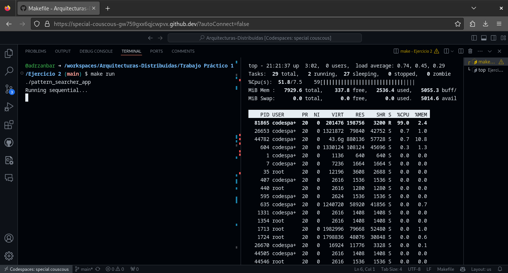

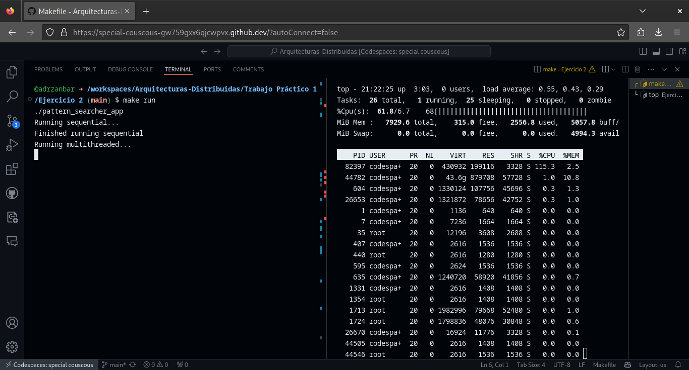

##### Output

```plaintext
Running sequential...
Finished running sequential
Running multithreaded...
Finished running multithreaded
Sequential Time: 1.89767 seconds
Multithreaded Time: 1.52233 seconds
Number of Threads Used: 20
Number of Threads Available on System: 2
Speedup: 1.24655
Efficiency: 0.0623276
Pattern             Occurrences (Seq)   Occurrences (Multi) 
------------------------------------------------------------
1328urt9wefh                  0                             0                             
3re23dfw2df                   0                             0                             
3rt3f34f34                    0                             0                             
asdfsadfsda                   0                             0                             
dslfsdlñfalñ                0                             0                             
ertertrett                    6                             6                             
fdsfds                        3622                          3622                          
fdsfsdfawr32                  14                            14                            
fdsñlfjsldkfjlñjlsdjflsd    0                             0                             
fjp2wñ{ffwnlwk43nlk          3                             3                             
fjsdlkñfjasld                0                             0                             
fjsldfjsdñfjlñ              2                             2                             
fsjdlafjsdlf                  0                             0                             
fsjdlafjsdlfsda               0                             0                             
fsjdlaflf                     0                             0                             
rw254t6g3t34                  0                             0                             
sdds                          0                             0                             
sdlfjasldñjflñsadf          0                             0                             
sdlfñlasd                    0                             0                             
werrfew                       4                             4 
```

### Computadora

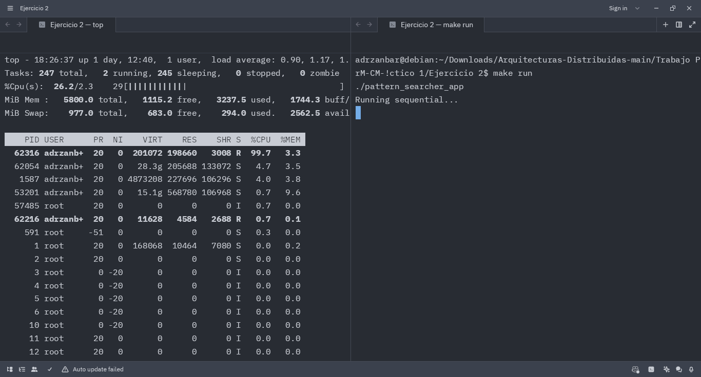

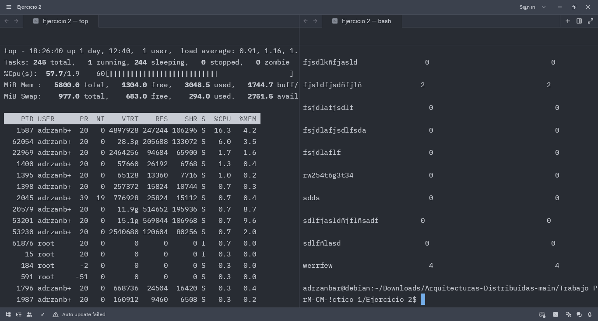

##### Output

```plaintext
Running sequential...
Finished running sequential
Running multithreaded...
Finished running multithreaded
Sequential Time: 3.90347 seconds
Multithreaded Time: 1.86415 seconds
Number of Threads Used: 20
Number of Threads Available on System: 4
Speedup: 2.09397
Efficiency: 0.104698
Pattern             Occurrences (Seq)   Occurrences (Multi)
------------------------------------------------------------
1328urt9wefh                  0                             0
3re23dfw2df                   0                             0
3rt3f34f34                    0                             0
asdfsadfsda                   0                             0
dslfsdlñfalñ                0                             0
ertertrett                    6                             6
fdsfds                        3622                          3622
fdsfsdfawr32                  14                            14
fdsñlfjsldkfjlñjlsdjflsd    0                             0
fjp2wñ{ffwnlwk43nlk          3                             3
fjsdlkñfjasld                0                             0
fjsldfjsdñfjlñ              2                             2
fsjdlafjsdlf                  0                             0
fsjdlafjsdlfsda               0                             0
fsjdlaflf                     0                             0
rw254t6g3t34                  0                             0
sdds                          0                             0
sdlfjasldñjflñsadf          0                             0
sdlfñlasd                    0                             0
werrfew                       4                             4
```

## Ejercicio 3

### Codespaces

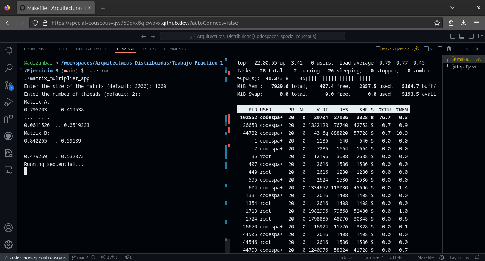


##### Output

```plaintext
Enter the size of the matrix (default: 3000): 
Enter the number of threads (default: 2): 
Matrix A:
0.809454 ... 0.543437
... ... ...
0.453599 ... 0.306126
Matrix B:
0.0627114 ... 0.732278
... ... ...
0.917257 ... 0.096726
Running sequential...
Finished running sequential
Running multithreaded...
Finished running multithreaded
Sequential Time: 560.549 seconds
Multithreaded Time: 449.837 seconds
Number of Threads Used: 2
Number of Threads Available on System: 2
Speedup: 1.24611
Efficiency: 0.623057
Result sequential:
732.708 ... 756.919
... ... ...
742.224 ... 759.29
Result multithreaded:
732.708 ... 756.919
... ... ...
742.224 ... 759.29
```

### Computadora

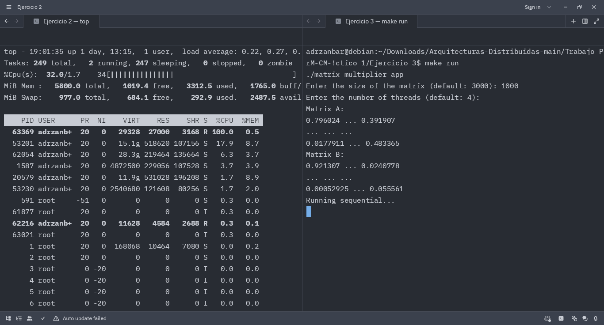

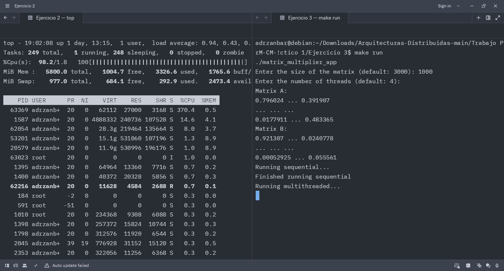


##### Output

```plaintext
Enter the size of the matrix (default: 3000):
Enter the number of threads (default: 4):
Matrix A:
0.810385 ... 0.973673
... ... ...
0.523292 ... 0.500065
Matrix B:
0.592636 ... 0.323158
... ... ...
0.263162 ... 0.741203
Running sequential...
Finished running sequential
Running multithreaded...
Finished running multithreaded
Sequential Time: 1184.19 seconds
Multithreaded Time: 465.832 seconds
Number of Threads Used: 4
Number of Threads Available on System: 4
Speedup: 2.5421
Efficiency: 0.635524
Result sequential:
745.062 ... 758.485
... ... ...
743.502 ... 747.914
Result multithreaded:
745.062 ... 758.485
... ... ...
743.502 ... 747.914
```

# Ejercicio 4

### Codespaces

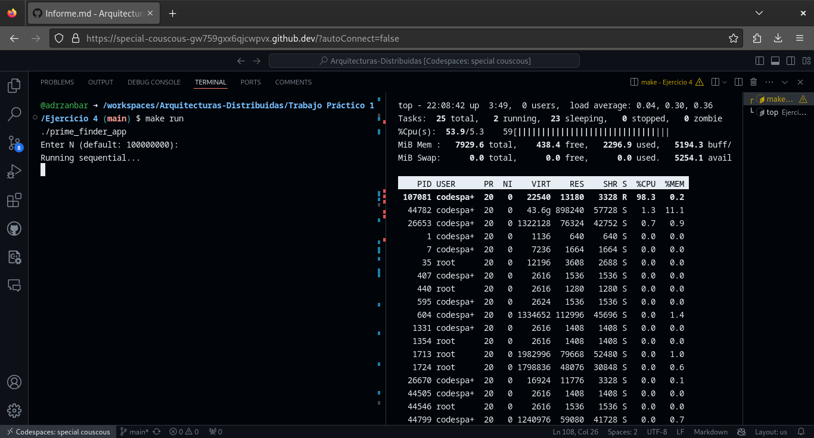

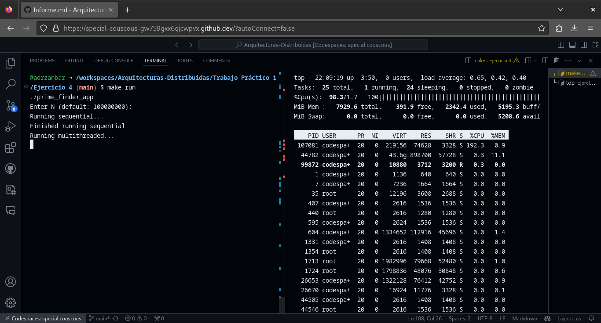


##### Output

```plaintext
Enter N (default: 100000000): 
Running sequential...
Finished running sequential
Running multithreaded...
Finished running multithreaded
Sequential Time: 34.3567 seconds
Multithreaded Time: 35.3442 seconds
Number of Threads Used: 2
Number of Threads Available on System: 2
Speedup: 0.972061
Efficiency: 0.48603
Top 10 prime numbers (sequential): 99999787 99999821 99999827 99999839 99999847 99999931 99999941 99999959 99999971 99999989 
Top 10 prime numbers (multithreaded): 99999787 99999821 99999827 99999839 99999847 99999931 99999941 99999959 99999971 99999989 
```

### Computadora

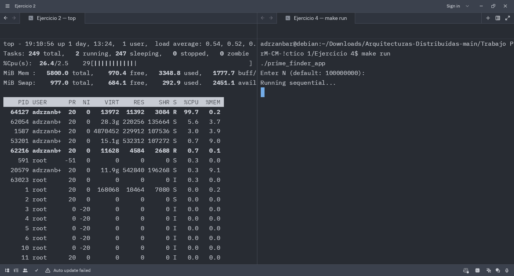

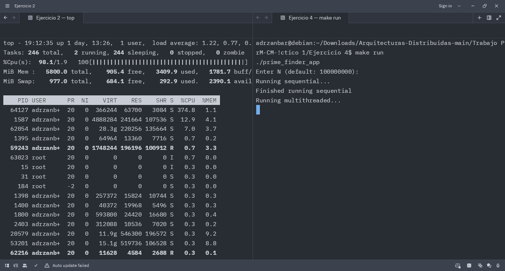

##### Output

```plaintext
Enter N (default: 100000000):
Running sequential...
Finished running sequential
Running multithreaded...
Finished running multithreaded
Sequential Time: 125.225 seconds
Multithreaded Time: 59.7122 seconds
Number of Threads Used: 4
Number of Threads Available on System: 4
Speedup: 2.09714
Efficiency: 0.524286
Top 10 prime numbers (sequential): 99999787 99999821 99999827 99999839 99999847 99999931 99999941 99999959 99999971 99999989
Top 10 prime numbers (multithreaded): 99999787 99999821 99999827 99999839 99999847 99999931 99999941 99999959 99999971 99999989
```

## Cómo correr

> /src/ $ make
> /src/ $ make run
