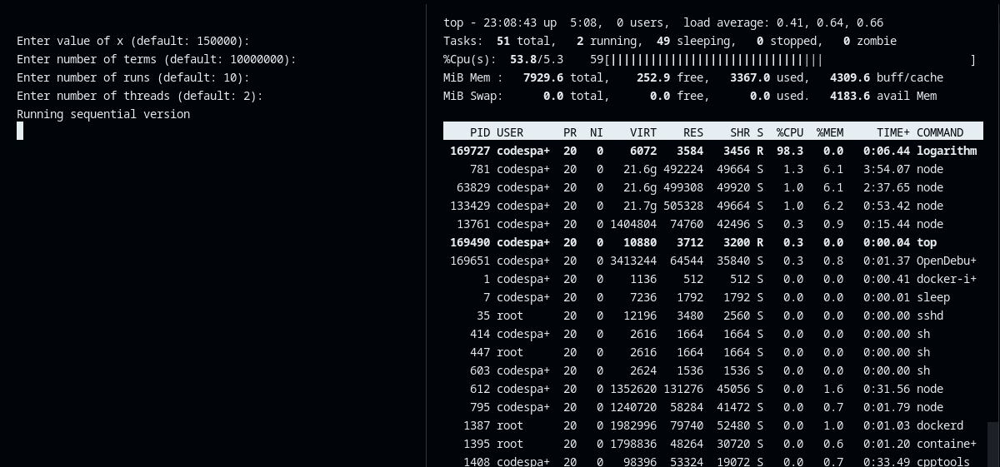
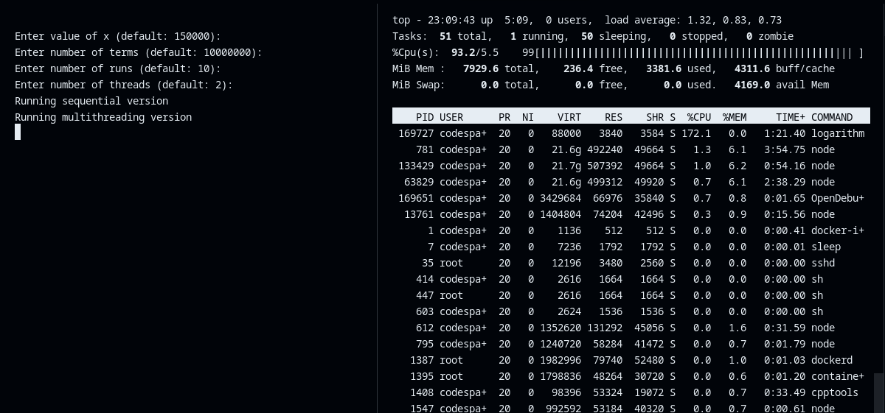
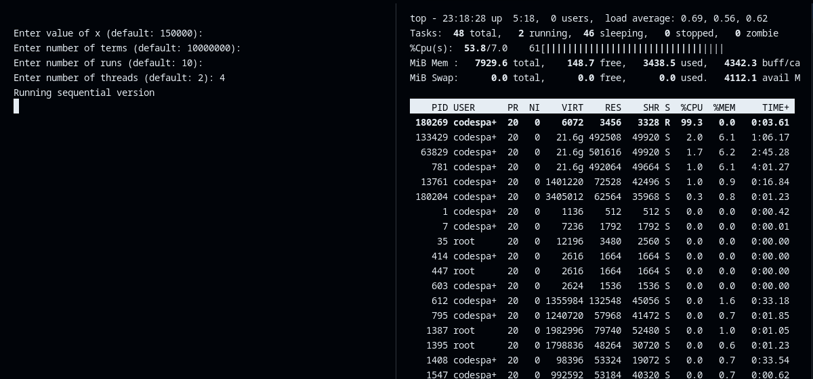
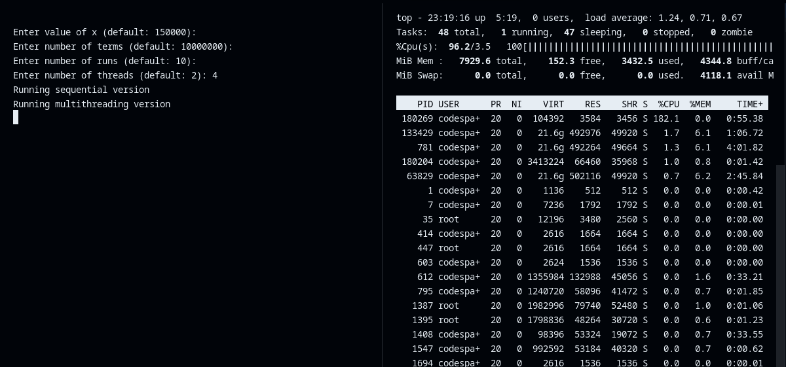

# Trabajo Práctivo N° 1: Informe

- Universidad Nacional de Cuyo
- Facultad de Ingeniería
- Licenciatura en Ciencias de La Computación
- Arquitecturas Distribuidas 2024
- Tema: Paralelismo a Nivel de Datos

## Introducción

En este trabajo práctico se pide resolver problemas paralelizables empleando la
técnica de multihilos para disminuir el tiempo de ejecución o incrementar el
throughput.

En todos los ejercicios se pide obtener datos sobre tiempos de ejecución para
calcular speedups y visualizar porcentajes de uso de cada núcleo de su
computador.

## Objetivos

- Resolver diferentes problemas con cierto grado de paralelismo mediante la
técnica de multihilos empleando librerías y C++.
- Analizar las ventajas y limitaciones de esta técnica.

## Entornos

- [Github Codespaces](https://github.com/features/codespaces)

```plaintext
$ lscpu
Architecture:                       x86_64
CPU op-mode(s):                     32-bit, 64-bit
Byte Order:                         Little Endian
Address sizes:                      48 bits physical, 48 bits virtual
CPU(s):                             2
On-line CPU(s) list:                0,1
Thread(s) per core:                 2
Core(s) per socket:                 1
Socket(s):                          1
NUMA node(s):                       1
Vendor ID:                          AuthenticAMD
CPU family:                         25
Model:                              1
Model name:                         AMD EPYC 7763 64-Core Processor
Stepping:                           1
CPU MHz:                            2603.123
BogoMIPS:                           4890.86
Virtualization:                     AMD-V
Hypervisor vendor:                  Microsoft
Virtualization type:                full
L1d cache:                          32 KiB
L1i cache:                          32 KiB
L2 cache:                           512 KiB
L3 cache:                           32 MiB
NUMA node0 CPU(s):                  0,1
```

- Computadora

```plaintext
$ lscpu
Architecture:             x86_64
  CPU op-mode(s):         32-bit, 64-bit
  Address sizes:          43 bits physical, 48 bits virtual
  Byte Order:             Little Endian
CPU(s):                   4
  On-line CPU(s) list:    0-3
Vendor ID:                AuthenticAMD
  Model name:             AMD Ryzen 3 3250U with Radeon Graphics
    CPU family:           23
    Model:                24
    Thread(s) per core:   2
    Core(s) per socket:   2
    Socket(s):            1
    Stepping:             1
    Frequency boost:      enabled
    CPU(s) scaling MHz:   66%
    CPU max MHz:          2600.0000
    CPU min MHz:          1400.0000
    BogoMIPS:             5189.88
    Flags:                fpu vme de pse tsc msr pae mce cx8 apic sep mtrr pge mca cmov pat pse36 clflush mmx fxs
                          r sse sse2 ht syscall nx mmxext fxsr_opt pdpe1gb rdtscp lm constant_tsc rep_good nopl n
                          onstop_tsc cpuid extd_apicid aperfmperf rapl pni pclmulqdq monitor ssse3 fma cx16 sse4_
                          1 sse4_2 movbe popcnt aes xsave avx f16c rdrand lahf_lm cmp_legacy svm extapic cr8_lega
                          cy abm sse4a misalignsse 3dnowprefetch osvw skinit wdt tce topoext perfctr_core perfctr
                          _nb bpext perfctr_llc mwaitx cpb hw_pstate ssbd ibpb vmmcall fsgsbase bmi1 avx2 smep bm
                          i2 rdseed adx smap clflushopt sha_ni xsaveopt xsavec xgetbv1 clzero irperf xsaveerptr a
                          rat npt lbrv svm_lock nrip_save tsc_scale vmcb_clean flushbyasid decodeassists pausefil
                          ter pfthreshold avic v_vmsave_vmload vgif overflow_recov succor smca sev sev_es
Virtualization features:
  Virtualization:         AMD-V
Caches (sum of all):
  L1d:                    64 KiB (2 instances)
  L1i:                    128 KiB (2 instances)
  L2:                     1 MiB (2 instances)
  L3:                     4 MiB (1 instance)
NUMA:
  NUMA node(s):           1
  NUMA node0 CPU(s):      0-3
```

## Experimentos

### Codespaces

#### 2 hilos

```plaintext
Enter value of x (default: 150000): 
Enter number of terms (default: 10000000): 
Enter number of runs (default: 10): 
Enter number of threads (default: 2): 
Running sequential version
Running multithreading version

Performance Metrics:
Average Sequential Time: 4.68569 seconds
Average Multithreaded Time: 2.96999 seconds
Speedup: 1.57768
Efficiency: 0.78884
```





#### 4 hilos

```plaintext
Enter value of x (default: 150000): 
Enter number of terms (default: 10000000): 
Enter number of runs (default: 10): 
Enter number of threads (default: 2): 4
Running sequential version
Running multithreading version

Performance Metrics:
Average Sequential Time: 4.66372 seconds
Average Multithreaded Time: 2.94382 seconds
Speedup: 1.58424
Efficiency: 0.39606
```





### Computadora